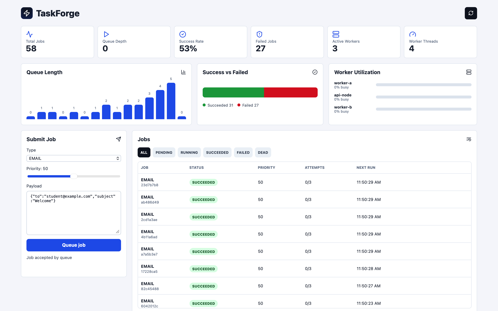
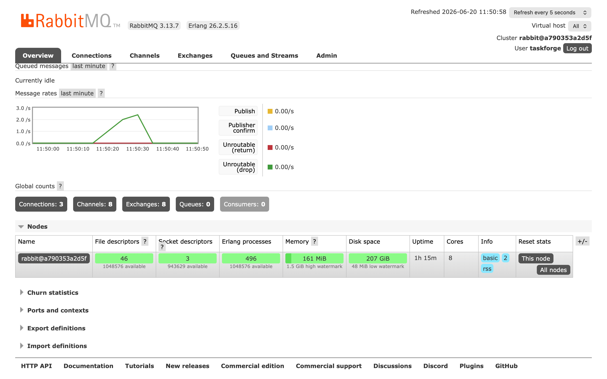
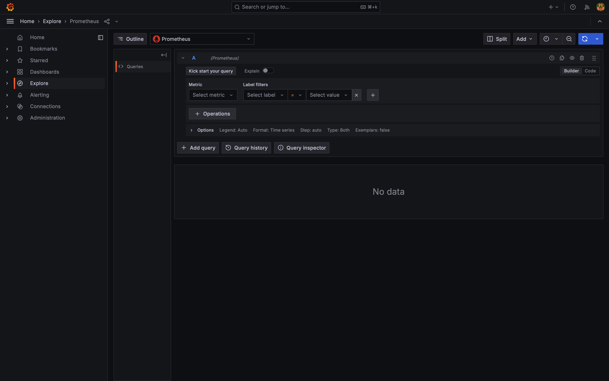
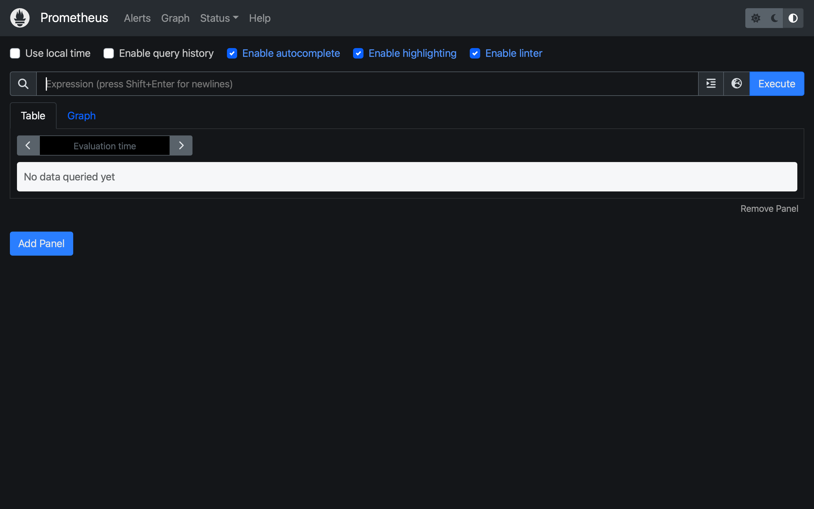

# TaskForge

TaskForge is a distributed job processing system built with Spring Boot, PostgreSQL, RabbitMQ, Redis, Prometheus, Grafana, and a React monitoring dashboard. It accepts jobs through REST APIs, stores them durably, and processes them asynchronously with multiple worker nodes.

This project was built to explore real-world backend patterns beyond CRUD applications, including asynchronous processing, fault tolerance, distributed workers, and production monitoring.

## Why TaskForge?

Modern applications should not perform expensive work inside user requests. Tasks such as email delivery, report generation, image processing, and webhook execution are typically executed asynchronously.

TaskForge demonstrates how production systems handle background work through durable queues, worker pools, retries, dead-letter handling, monitoring, and event-driven communication.

## Features

- REST API to submit, list, inspect, and requeue jobs
- PostgreSQL-backed durable job queue
- Priority-based scheduling with pessimistic locking
- Multi-worker job claiming for horizontally scaled workers
- Retry flow with exponential backoff
- Dead-letter state for repeatedly failing jobs
- Stale job recovery and worker heartbeat tracking
- Job lifecycle timeline from creation to completion or failure
- RabbitMQ lifecycle event publishing
- Redis-backed queue statistics snapshot
- Prometheus metrics and pre-provisioned Grafana dashboard
- React dashboard for jobs, metrics, workers, and timeline data
- Swagger/OpenAPI documentation
- Docker Compose setup for the full stack

## Screenshots

### TaskForge Dashboard



### System Architecture

```text
Client / React Dashboard
        |
        v
Spring Boot API
        |
        +------> PostgreSQL Job Queue
                         |
                         v
                   Worker Pool
                   /        \
                  /          \
             Worker A      Worker B
                  |          |
                  v          v
              Job Execution + Retry / Dead Letter Handling
                         |
                         v
                  RabbitMQ Events
                         |
                         v
          Monitoring Stack: Redis + Prometheus + Grafana
```

### RabbitMQ Management



### Grafana Prometheus Explore



### Prometheus Query UI



## Tech Stack

| Area | Technology |
| --- | --- |
| Backend | Java 21, Spring Boot 3.3, Gradle |
| Database | PostgreSQL 16, H2 for local fallback |
| Messaging | RabbitMQ |
| Cache / stats | Redis |
| Frontend | React 18, TypeScript, Vite |
| Monitoring | Spring Actuator, Prometheus, Grafana |
| API docs | Springdoc OpenAPI / Swagger UI |

## Key Engineering Concepts

- Concurrent programming
- Distributed work queues
- Event-driven architecture
- Fault tolerance
- Retry and backoff strategies
- Dead-letter queues
- Worker heartbeats
- Pessimistic locking
- Observability and monitoring
- Horizontal scaling

## Scale Demonstrated

- Multiple worker containers running against the same durable queue
- Concurrent job execution through configurable worker thread pools
- Automatic retry handling for failed jobs
- Dead-letter handling after maximum retry attempts
- Stale job recovery for worker failure scenarios
- Real-time metrics collection through API, Redis, Prometheus, and Grafana
- Durable job persistence with PostgreSQL

The Docker setup starts one API container plus two worker containers (`worker-a` and `worker-b`) so the distributed claiming flow can be tested locally.

## Project Structure

```text
taskforge/
├── backend/                  # Spring Boot API and worker engine
├── frontend/                 # React + Vite dashboard
├── docs/                     # API notes and interview notes
├── monitoring/               # Prometheus and Grafana configuration
├── docker-compose.yml        # Full local stack
└── README.md
```

## Prerequisites

- Docker and Docker Compose for the full-stack setup
- Java 21 and Gradle if running the backend locally
- Node.js and npm if running the frontend locally

## Run with Docker

From the project root:

```bash
docker compose up --build
```

Available services:

| Service | URL / Port | Credentials |
| --- | --- | --- |
| Frontend dashboard | `http://localhost:5173` | - |
| Backend API | `http://localhost:8080` | - |
| Swagger UI | `http://localhost:8080/swagger-ui/index.html` | - |
| PostgreSQL | `localhost:5432` | `taskforge` / `taskforge` |
| RabbitMQ management | `http://localhost:15672` | `taskforge` / `taskforge` |
| Redis | `localhost:6379` | - |
| Prometheus | `http://localhost:9090` | - |
| Grafana | `http://localhost:3000` | `admin` / `taskforge` |

To stop the stack:

```bash
docker compose down
```

To remove persisted database and Grafana volumes as well:

```bash
docker compose down -v
```

## Run Backend Locally

The backend can run without PostgreSQL, RabbitMQ, or Redis. By default it uses in-memory H2, and RabbitMQ/Redis integrations are disabled.

```bash
cd backend
gradle bootRun
```

The backend starts on:

```text
http://localhost:8080
```

## Run Frontend Locally

```bash
cd frontend
npm install
npm run dev
```

The Vite dev server starts on:

```text
http://localhost:5173
```

## API Examples

Submit a successful job:

```bash
curl -X POST http://localhost:8080/api/jobs \
  -H "Content-Type: application/json" \
  -d '{"type":"EMAIL","priority":80,"payload":"{\"to\":\"student@example.com\"}"}'
```

Submit a job that exercises retry and dead-letter behavior:

```bash
curl -X POST http://localhost:8080/api/jobs \
  -H "Content-Type: application/json" \
  -d '{"type":"WEBHOOK","priority":20,"payload":"{\"fail\":true}"}'
```

List all jobs:

```bash
curl http://localhost:8080/api/jobs
```

Filter jobs by status:

```bash
curl "http://localhost:8080/api/jobs?status=DEAD"
```

View a job timeline:

```bash
curl http://localhost:8080/api/jobs/<job-id>/events
```

Requeue a failed or dead job:

```bash
curl -X POST http://localhost:8080/api/jobs/<job-id>/requeue
```

Read metrics and worker data:

```bash
curl http://localhost:8080/api/metrics
curl http://localhost:8080/api/metrics/redis
curl http://localhost:8080/api/workers
```

More endpoint notes are available in [docs/API.md](docs/API.md).

## Configuration

The backend reads configuration from environment variables. Common variables:

| Variable | Default | Purpose |
| --- | --- | --- |
| `DATABASE_URL` | H2 in-memory URL | JDBC database connection |
| `DATABASE_USERNAME` | `sa` | Database username |
| `DATABASE_PASSWORD` | empty | Database password |
| `RABBITMQ_ENABLED` | `false` | Enables lifecycle event publishing |
| `RABBITMQ_HOST` | `localhost` | RabbitMQ host |
| `REDIS_STATS_ENABLED` | `false` | Enables Redis queue stats |
| `REDIS_HOST` | `localhost` | Redis host |
| `WORKER_NODE_ID` | `local-node` | Worker identity shown in heartbeats |
| `WORKER_THREAD_COUNT` | `4` | Worker execution thread count |
| `WORKER_BATCH_SIZE` | `4` | Number of jobs claimed per poll |
| `MAX_ATTEMPTS` | `3` | Attempts before a job becomes dead |

See [backend/src/main/resources/application.yml](backend/src/main/resources/application.yml) for the full list.

## How Job Processing Works

1. A client submits a job through `POST /api/jobs`.
2. The API stores the job and returns `202 Accepted`.
3. Worker nodes poll for jobs whose `nextRunAt` is due.
4. A worker claims jobs using database locking so multiple nodes do not process the same job.
5. Successful jobs move to `SUCCEEDED`.
6. Failed jobs are retried with exponential backoff.
7. Jobs that exceed the max attempt count move to `DEAD`.
8. Lifecycle events, worker heartbeats, and metrics are exposed to the API and dashboard.

## Testing and Build

Run backend tests:

```bash
cd backend
gradle test
```

Build the frontend:

```bash
cd frontend
npm run build
```

Build everything with Docker:

```bash
docker compose build
```

## Useful Links

- API documentation: `http://localhost:8080/swagger-ui/index.html`
- Prometheus targets and metrics: `http://localhost:9090`
- Grafana dashboard: `http://localhost:3000`
- RabbitMQ management UI: `http://localhost:15672`

## Future Improvements

- Idempotency keys for duplicate-safe job submission
- Authentication and role-based access control
- Per-job timeout and cancellation support
- Kafka or Redis Streams event adapter
- Richer Prometheus counters for lifecycle events
- Production database migrations with Flyway or Liquibase
